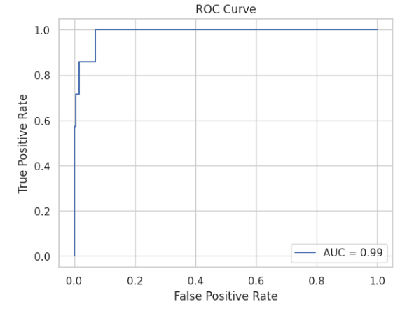

# Client Eligibility Prediction using Logistic Regression

This project demonstrates the process of predicting whether a bank client is eligible for credit approval. We use a Logistic Regression model to handle binary outcomes such as "approved" or "not approved".

This project is also a scaffolding for continuous integration using GitHub Actions, which runs the model training and evaluation pipeline on every push to the repository.

This badge:  indicates the status of the GitHub Actions workflow.

The metrics shown on this readme file are updated every time the workflow runs, ensuring continuous integration and delivery of the model, so in the future you want to use this scaffolding to analyze different data, you have a reliable and automated way to do it.

You can view the full analysis in the [Jupyter Notebook](./credit_elegibility_logreg.ipynb).

## Methods
- **Data preprocessing**: Creation of suitable variables that are distributed considering the underlying economic mechanisms and real-world phenomena that govern how wealth, income, and financial behavior are distributed. Distribution assessment using visualization and detection of correlated variables to drop and avoid multicollinearity.

-  **Response variable creation**: using real-world criteria, like thresholds on credit score and annual income.
- **Logistic Regression**: Applied to predict the binary outcome (credit approval: yes or no) .
- **Evaluation Metrics**: Kolmogorov-Smirnov (KS) , AUC/GINI, PSI score to evaluate the model.

## Results

After training the Logistic Regression model, the following key metrics were obtained:

### **KS Statistic**: `0.988`

**The Kolmogorov-Smirnov (KS)** statistic measures the separation between the **cumulative distribution functions (CDF)** of the positive and negative classes in a binary classification. This statistic tells us How good the model separates the two groups.

* KS Statistic ranges from 0 to 1, with 1 representing perfect separation and 0 meaning no separation.
* A higher KS value indicates better model performance.

The KS statistic is the maximum difference betwen the CDFs of the two classes:

$$
KS = max | F_{positive}(x) - F_{negative} (x) |
$$

Literature suggests (Reference : [Credit Risk Analytics: Measurement Techniques, Applications, and Examples in SAS](https://www.wiley.com/en-us/Credit+Risk+Analytics%3A+Measurement+Techniques%2C+Applications%2C+and+Examples+in+SAS-p-9781119143987)) a KS Statistic of 0.4 or higher is generally good for credit scoring models, being 0.6 an excellent statistic. For this tailored dataset the statisitic is just as expected: as high as possible. 

### **AUC**: `0.993`

The Area under the Receiver Operator Characteristic Curve AUC for this model measures the model's ability to distinguish between positive (apt for credit) and negative (not apt) classes.

The process to print it is illustrated in the [Jupyter Notebook](./credit_elegibility_logreg.ipynb), but here we can also paste it here:

AUC is calculated by plotting the True Positive Rate (sensitivity or recall) against the False Positive Rate (1-specificity) at different decision thresholds, and measuring the area under the resulting curve. 

We could say this metric is the probability that:

- A randomly chosen positive instance, is ranked higher by the model, than a randomly chosen negative instance.

the thresholds for this metric are stated as 0.8 < AUC < 0.9. (Reference: [Pattern Recognition and Machine Learning](https://link.springer.com/book/9780387310732)). 

 Having a dataset built to make sense, would allow you to expect such good performance for this metric. 

### **GINI Coefficient**: `0.986`

In a classification model, the Gini coefficient measures how well the model separates the positive (apt for credit) from the negative (not apt) class. This coefficient is closely related to the Area Under the Receiver Operating Characteristic Curve (AUC-ROC), they are related by the following equation

$$
Gini  = 2 * (AUC-1)
$$

* A Gini Coefficient of 1 represents perfect classification (the model perfectly distinguishes between classes).
* A Gini Coefficient of 0 suggests no discrimination power (random guessing).
* A Gini Coefficient below 0 indicates worse-than-random predictions.

Prior work (References: [Credit Scoring and Its Applications](https://epubs.siam.org/doi/book/10.1137/1.9781611974560), [Credit Risk Scorecards: Developing and Implementing Intelligent Credit Scoring](https://www.wiley.com/en-us/Credit+Risk+Scorecards%3A+Developing+and+Implementing+Intelligent+Credit+Scoring-p-9781119201731)) suggests  that a Gini coefficient grater than 0.5-0.6 is the ideal target for a classificantion model, keeping in mind 0.3- 0.5 can be accepted in early stages of model development. 

Again, Given the nature of the simulated dataset, The GINI coefficient accomplishes what was expected, a value close to 1 Which indigates good classification. 

### **PSI**: `0.184`

  PSI stands for Population Stability Index, which is used to compare two distributions:

  - The distribution of the outcome variable in the training set, in this case, whether or not the new credit line is approved for the training set observations
  - The distribution of that same variable in new data

This comparison is made by following these steps:

1. Binning the data sets: 
 The reference and test datasets are divided in to bins, of equal sizes. e.g. deciles

2. Calculating the proportion for each bin:
  The proportion of observations (In this specific case 1 = credit approved) in each bin, both for the reference dataset **$P_{ref}$** and the proportion of observations in the bin from the test dataset ****$P_{test}$**.

3. Measuring the sum of scaled differences between the proportions

Once the proportions of success in the test bin is calculated, it's difference from the training bin is calculated, and scaled as follows:

$$
PSI =  \sum \left( (P_{test}- P_{ref}) \cdot ln\left(\frac{P_{test}}{P_{ref}}     \right)         \right)
$$

Where : 
- **$P_{test}$** Is the proportion of observations in a bin from the test (new) dataset.

This way, we have a way to measure how the outcome variable changes between different populations, and assess whether or not the model is adequate, or if it should be re-trained. 

For this specific logistic regression model, with a PSI of 0.184, it is not needed to recalibrate the model yet, but there are minor population shifts. (reference: [Credit Risk Scorecards: Developing and Implementing Intelligent Credit Scoring](https://www.wiley.com/en-us/Credit+Risk+Scorecards%3A+Developing+and+Implementing+Intelligent+Credit+Scoring-p-9781119201731))
 
## Conclusion:

An automated continuously delivered process of training a machine learning logistic regression model is created and tested, with model metrics update being automated as well trough github actions. 

A synthetic dataset was simulated using python, having a sensible approach to the generation method of the response variable, using a set of logical conditions on client behaviour. The results of using this dataset motivate the use of real world data for the next project.

The distribution of the independent variables is assessed, as well multicollinearity detected using a correlation matrix.

The model demonstrates excellent performance across all key metrics, with strong discriminatory power (high KS, AUC, and GINI) and stable generalization (acceptable PSI). This indicates that the Logistic Regression model is highly effective in predicting credit eligibility.
